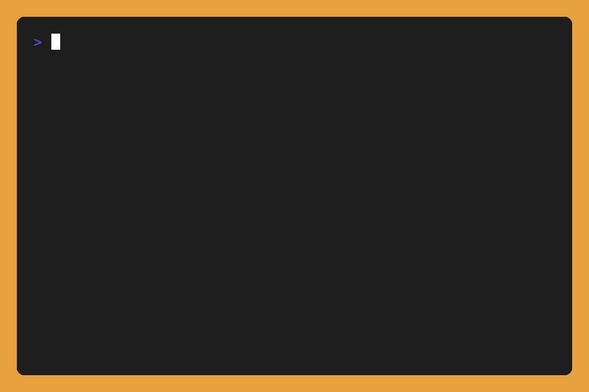

# ymmv.fyi

**The tools you actually use. Publish from the CLI, diff against anyone's.**

[](https://www.npmjs.com/package/ymmv-cli)
[](https://github.com/ymmv-fyi/ymmv/actions/workflows/ci.yml)

Editor, OS, shell, terminal, theme (and more), published to a
clean page at `ymmv.fyi/<handle>` in about 10 seconds. See a live one:
[ymmv.fyi/bardisty](https://ymmv.fyi/bardisty).



## Try it

```sh
npx ymmv-cli           # detect your stack, confirm, go live at ymmv.fyi/<you>
npx ymmv-cli bardisty  # view someone's stack in the terminal
```

First run includes a one-time GitHub sign-in. Every update after that is
instant. Works on macOS, Linux, Windows, and WSL.

## What you get

- **A clean, shareable page** at `ymmv.fyi/<handle>`.
- **Auto-detected.** It reads your OS, shell, prompt, terminal, editor, window manager,
  version manager, and AI tool from the environment, then pre-fills; you just confirm.
- **Instant updates.** Re-run any time; your page refreshes in seconds.
- **Nothing publishes until you confirm.** Detection only pre-fills, and `ymmv delete`
  removes everything.
- **Diffs.** View someone's profile while you're logged in, and you'll see how your stack compares:

  ```
    how bardisty differs from you

            BARDISTY  YOU
  ~ Editor  Zed       VS Code
  = Shell   bash      bash
  ~ Theme   Gruvbox   Catppuccin
  ~ Font    Lilex     JetBrains Mono

    3 differ   1 shared
  ```

  Also on the web: type a handle into the `diff vs` box on any profile page, or
  go straight to `ymmv.fyi/<them>/vs/<you>`.

- **Open data.** Every profile is JSON too: `GET https://ymmv.fyi/api/v1/u/<handle>`.
  Full contract (shape, statuses, caching, CORS): [docs/api.md](docs/api.md).

## Commands

Run with `npx ymmv-cli` (no install), or `npm i -g ymmv-cli` once for the short `ymmv`:

- `ymmv` detects, confirms, and publishes (re-run any time to update; `ymmv publish` is the same command)
- `ymmv <handle>` views a profile, or diffs it against yours when you're logged in
- `ymmv set editor Neovim` changes one value
- `ymmv set --extra "Keyboard=HHKB"` adds a free-form line of your own (`-e` works too)
- `ymmv unset editor` removes one value (`ymmv set editor -` works too); `ymmv unset --extra "Keyboard"` removes an extra
- `ymmv delete` removes your profile (`ymmv delete -y` skips the confirm, for scripts)
- `ymmv login` / `ymmv logout` sign in / out
- `ymmv version` prints the CLI version

## Developing

Node 22+ and pnpm. Three packages: `shared` (types, tool catalog, diff engine),
`cli` (the `ymmv-cli` npm package), and `web` (Astro on Cloudflare Workers + D1).

```sh
pnpm install
pnpm build     # all packages; @ymmv/shared first, cli and web depend on it
pnpm dev       # hot-reloading site at localhost:4321
```

The full gate, same as CI:

```sh
pnpm lint && pnpm build && pnpm typecheck && pnpm test
pnpm --filter @ymmv/web exec playwright install chromium   # once
pnpm --filter @ymmv/web test:e2e                           # for web changes
```

Two more workflows worth knowing:

- **Try your local CLI:** `node packages/cli/dist/cli.js` after a build. Point
  `YMMV_API` at a local Worker to keep writes off production.
- **Browse the site with real data:** `pnpm --filter @ymmv/web e2e:serve` runs a
  seeded local Worker (real D1 + bindings) at `localhost:8788`.

Versions are tag-driven: every `package.json` stays at `0.0.0` and CI stamps the
real version from the `vX.Y.Z` tag at publish time. Don't bump anything.

## License

[MIT](LICENSE).
